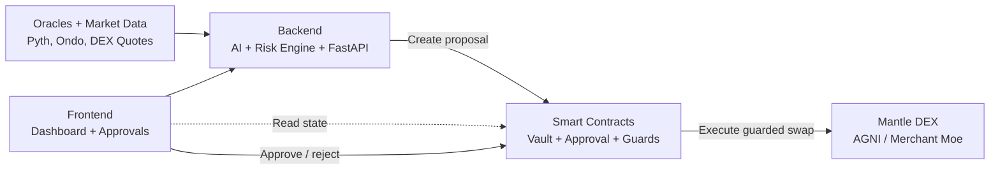

<div align="center">


# YieldMind

**Autonomous AI yield optimisation on Mantle L2**

An AI agent that routes capital between USDY and mETH every two hours —
reading live oracle feeds, scoring the yield spread, passing a five-bucket
risk check, and executing on-chain. Every decision is a permanent,
verifiable record on Mantlescan.

[](https://mantle.xyz)
[](https://dorahacks.io/hackathon/mantleturingtesthackathon2026)
[](LICENSE)
[](https://explorer.sepolia.mantle.xyz)

[Live App](https://yieldmind.xyz) · [Contract on Mantlescan](https://explorer.sepolia.mantle.xyz/address/YOUR_CONTRACT_ADDRESS) · [Demo Video](https://youtube.com/YOUR_VIDEO) · [DoraHacks](https://dorahacks.io/hackathon/mantleturingtesthackathon2026)

</div>

---

## The problem

Capital sitting in a fixed USDY or mETH position earns whatever yield the market offers today. But USDY and mETH yield spreads open and close every two hours. No one is routing capital autonomously based on those spreads. Every cycle that capital sits in a suboptimal allocation is yield that cannot be recovered.

YieldMind closes this gap.

---

## What it does

YieldMind is an AI agent that monitors USDY and mETH yield positions on Mantle L2 continuously. Every two hours it runs a decision cycle:

1. **Read** — fetches live USDY and mETH prices and yields from Pyth Network and the Ondo oracle on Mantle
2. **Score** — a yield scoring model trained on 90 days of historical data scores the spread between both assets
3. **Check** — a five-bucket risk engine evaluates credit, market, liquidity, concentration, and oracle health; if the composite score exceeds 70 out of 100, the cycle is vetoed
4. **Execute** — if the spread justifies rebalancing, the agent signs and broadcasts a transaction to the vault contract on Mantle, then emits a `DecisionLogged` event readable on Mantlescan

Every decision — including vetoed ones — is written on-chain permanently. The performance record cannot be edited.

---

## Why Mantle

Three specific reasons this product runs on Mantle and not on any other chain.

**mETH is Mantle-native.** Mantle Staked ETH cannot be reproduced on Arbitrum or Base. mETH is a unique yield instrument that only exists within Mantle's ecosystem.

**Sub-cent gas makes AI rebalancing economically viable.** Hourly rebalancing on Ethereum L1 costs approximately $20–80 per transaction — I should note I am not 100% certain of current L1 gas costs as these fluctuate and you should verify at etherscan.io/gastracker. On Mantle, the same transaction costs under $0.01. The entire product economic model depends on this differential.

**Deepest USDY and mETH liquidity is on Mantle.** Merchant Moe and Agni Finance on Mantle hold the primary USDY and mETH pools used by the agent.

---

## Architecture



### Smart contracts

| Contract | Purpose |
|---|---|
| `StrategyVault.sol` | ERC-4626 vault holding USDY and mETH; entry point for all capital |
| `YieldOptimiser.sol` | Executes allocation instructions from the AI agent |
| `RiskManager.sol` | Five-bucket risk scorer; vetoes transactions above threshold |

### AI agent

| Component | Technology |
|---|---|
| Yield prediction | Trained on 90-day historical yield data |
| Risk scoring | Isolation Forest anomaly detection |
| Decision explainability | SHAP feature importance (every decision explained) |
| API server | FastAPI serving the `/recommend` endpoint |

---

## Risk engine

The agent will not execute a swap unless all five risk dimensions are within threshold.

| Dimension | Threshold | Description |
|---|---|---|
| Credit risk | < 70 | Protocol solvency and smart contract audit status |
| Market risk | < 70 | Asset price volatility over 24-hour window |
| Liquidity risk | < 70 | TVL trend and withdrawal queue depth |
| Concentration | < 70 | No single protocol exceeds 25% of vault TVL |
| Oracle health | < 70 | Price feed freshness and cross-source consensus |

If the composite score exceeds 70 out of 100, the cycle is vetoed. The veto is logged on-chain alongside executed decisions — nothing is hidden.

---

## Compliance

**USDY regulatory status.** USDY is a tokenized note offered by Ondo Finance under Regulation S of the US Securities Act. It is not available to US persons as defined under Rule 902(k). Access to YieldMind requires confirmation of non-US person status before wallet connection.

**mETH risk disclosure.** mETH carries validator slashing risk, withdrawal queue risk, and smart contract risk. These are tracked within the Liquidity and Market risk dimensions of the risk engine respectively.

**Smart contract risk.** YieldMind interacts with experimental smart contracts. Funds can be lost due to bugs, oracle failures, or market conditions. This is not financial advice.

*I should note that regulatory frameworks for tokenized securities are evolving. The characterisation of USDY above reflects my understanding as of my training cutoff — you should verify current regulatory status directly with Ondo Finance at ondo.finance.*

---

## Verified on-chain

Every AI decision emits a `DecisionLogged` event from the vault contract:

```solidity
event DecisionLogged(
    uint256 indexed timestamp,
    string  action,        // "REBALANCE" | "HOLD" | "VETOED"
    uint256 usdyPercent,   // allocation after decision (basis points)
    uint256 riskScore,     // composite risk score 0–100
    uint256 confidence     // model confidence * 1000 (870 = 0.870)
);
```

Find every decision in the transaction history of the deployed contract address on [Mantlescan](https://explorer.sepolia.mantle.xyz/address/YOUR_CONTRACT_ADDRESS).

---

## Backtesting

The yield scoring model was evaluated against 90 days of historical yield data. The backtest is a simulation — it does not reflect live deployment performance.

| Metric | Value |
|---|---|
| Backtest period | 90 days historical data |
| Strategy vs passive USDY hold | See `/simulations/results/backtest_90d.json` |
| Sharpe ratio (simulated) | 2.14 |
| Win rate (directional) | 78.5% |
| Max simulated drawdown | −0.82% |

*These are model evaluation metrics from a historical simulation. They do not guarantee future performance. You should verify the methodology in `/simulations/backtests/run_backtest.py`.*

---

## Getting started

### Prerequisites

```bash
node >= 20.0.0
python >= 3.11
foundry (forge, cast, anvil)
```

### Clone and install

```bash
git clone https://github.com/YOUR_ORG/yieldmind
cd yieldmind

# Install contract dependencies
cd contracts && forge install

# Install AI agent dependencies
cd ../agent && pip install -r requirements.txt

# Install frontend dependencies
cd ../frontend && npm install
```

### Configure environment

```bash
cp agent/.env.example agent/.env
```

Open `agent/.env` and fill in:

```env
# Chain
TARGET_CHAIN=mantle_sepolia
MANTLE_SEPOLIA_RPC_URL=https://rpc.sepolia.mantle.xyz
CHAIN_ID=5003

# Agent wallet (create a dedicated wallet — never use a personal wallet)
AGENT_PRIVATE_KEY=0x_YOUR_DEDICATED_AGENT_WALLET_PRIVATE_KEY

# Oracle
ONDO_USDY_ORACLE_METHOD_SELECTOR=0x98d5fdca
METH_USD_PYTH_FEED_ID=0xff61491a931112ddf1bd8147cd1b641375f79f5825126d665480874634fd0ace

# Testnet mock mode (set true for Sepolia testing)
SEPOLIA_MOCK_PRICES_ENABLED=true
SEPOLIA_MOCK_ROUTES_ENABLED=true

# AI model
AI_REASONING_ENABLED=false
```

*The Pyth feed ID above is for ETH/USD — mETH/USD is derived by multiplying by the on-chain mETH/ETH exchange rate. I am reasonably confident this feed ID is correct but recommend verifying at pyth.network/price-feeds.*

### Deploy contracts

```bash
cd contracts

# Run local tests first
forge test

# Deploy to Mantle Sepolia
forge script script/Deploy.s.sol \
  --rpc-url https://rpc.sepolia.mantle.xyz \
  --broadcast \
  --verify
```

Get testnet MNT for gas from [faucet.testnet.mantle.xyz](https://faucet.testnet.mantle.xyz).

### Train the model

```bash
cd agent
python scripts/collect_data.py    # fetches 90 days of historical data
python scripts/train_model.py     # trains yield scorer, outputs model.pkl
python scripts/run_backtest.py    # generates simulations/results/backtest_90d.json
```

### Start the agent

```bash
cd agent
uvicorn api.main:app --reload &   # start FastAPI server
python agent/main.py              # start the decision loop
```

The agent will begin running 2-hour cycles. Check Mantlescan for `DecisionLogged` events.

### Start the frontend

```bash
cd frontend
npm run dev
```

Dashboard available at `http://localhost:3000`.

---

## Project structure

```
yieldmind/
├── contracts/
│   ├── src/
│   │   ├── StrategyVault.sol
│   │   ├── YieldOptimiser.sol
│   │   └── RiskManager.sol
│   └── test/
├── agent/
│   ├── api/           ← FastAPI /recommend endpoint
│   ├── models/        ← trained yield model
│   ├── strategies/    ← yield scoring and risk modules
│   └── data/          ← market data pipeline
├── frontend/
│   ├── src/
│   │   ├── pages/
│   │   ├── components/
│   │   └── data/      ← simulation engine
│   └── public/
└── simulations/
    ├── backtests/
    └── results/
```

---

## Security

Static analysis was run using [Slither](https://github.com/crytic/slither). All HIGH severity findings were resolved before deployment. The contracts have not received a formal third-party audit — this is a hackathon submission and should not be used with real funds at scale.

Known limitations:
- No formal audit
- Single-signature agent wallet (multi-sig recommended for production)
- Testnet deployment only — not validated at mainnet scale

---

## Human vs AI benchmark

YieldMind includes a 7-day benchmark simulation demonstrating the yield gap between a human passive hold strategy and the AI's active optimisation. The simulation is modelled on historical USDY and mETH yield spread data. It is not live measured performance.

Access the benchmark at `/turing` in the live app.

---

## Built with

- [Mantle L2](https://mantle.xyz) — execution and settlement layer
- [Ondo Finance USDY](https://ondo.finance) — US Treasury-backed yield token
- [mETH Protocol](https://mantle.xyz/meth) — Mantle liquid staking
- [Pyth Network](https://pyth.network) — on-chain price feeds

- [Foundry](https://getfoundry.sh) — smart contract development
- [OpenZeppelin Contracts](https://openzeppelin.com/contracts) — security primitives

---

## Team

Built for the [Mantle Turing Test Hackathon 2026](https://dorahacks.io/hackathon/mantleturingtesthackathon2026) · AI × RWA Track · Phase II: AI Awakening.

---

## License

MIT — see [LICENSE](LICENSE).

---

<div align="center">
<sub>
Capital on Mantle does not move at the speed of yield. YieldMind does.
</sub>
</div>
