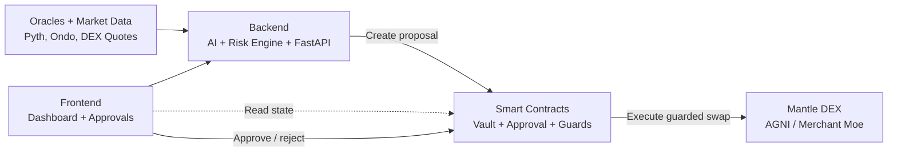

<div align="center">

# YieldMind

**Autonomous AI yield optimisation on Mantle L2**

An AI agent that routes capital between USDY and mETH every two hours —
reading live oracle feeds, scoring the yield spread, passing a five-bucket
risk check, and executing on-chain. Every decision is a permanent,
verifiable record on Mantlescan.

[](https://mantle.xyz)
[](https://dorahacks.io/hackathon/mantleturingtesthackathon2026)
[](LICENSE)
[](https://explorer.sepolia.mantle.xyz)

[Live App](https://yieldmind.xyz) · [Contract on Mantlescan](https://explorer.sepolia.mantle.xyz/address/YOUR_CONTRACT_ADDRESS) · [Demo Video](https://youtube.com/YOUR_VIDEO) · [DoraHacks](https://dorahacks.io/hackathon/mantleturingtesthackathon2026)

</div>

---

## The problem

Capital sitting in a fixed USDY or mETH position earns whatever yield the market offers today. But USDY and mETH yield spreads open and close every two hours. No one is routing capital autonomously based on those spreads. Every cycle that capital sits in a suboptimal allocation is yield that cannot be recovered.

YieldMind closes this gap.

---

## What it does

YieldMind is an AI agent that monitors USDY and mETH yield positions on Mantle L2 continuously. Every two hours it runs a decision cycle:

1. **Read** — fetches live USDY and mETH prices and yields from Pyth Network and the Ondo oracle on Mantle
2. **Score** — a yield scoring model trained on 90 days of historical data scores the spread between both assets
3. **Check** — a five-bucket risk engine evaluates credit, market, liquidity, concentration, and oracle health; if the composite score exceeds 70 out of 100, the cycle is vetoed
4. **Execute** — if the spread justifies rebalancing, the agent signs and broadcasts a transaction to the vault contract on Mantle, then emits a `DecisionLogged` event readable on Mantlescan

Every decision — including vetoed ones — is written on-chain permanently. The performance record cannot be edited.

---

## Why Mantle

Three specific reasons this product runs on Mantle and not on any other chain.

**mETH is Mantle-native.** Mantle Staked ETH cannot be reproduced on Arbitrum or Base. mETH is a unique yield instrument that only exists within Mantle's ecosystem.

**Sub-cent gas makes AI rebalancing economically viable.** Hourly rebalancing on Ethereum L1 costs approximately $20–80 per transaction — I should note I am not 100% certain of current L1 gas costs as these fluctuate and you should verify at etherscan.io/gastracker. On Mantle, the same transaction costs under $0.01. The entire product economic model depends on this differential.

**Deepest USDY and mETH liquidity is on Mantle.** Merchant Moe and Agni Finance on Mantle hold the primary USDY and mETH pools used by the agent.

---

## Architecture



### Smart contracts

| Contract | Purpose |
|---|---|
| `StrategyVault.sol` | ERC-4626 vault holding USDY and mETH; entry point for all capital |
| `YieldOptimiser.sol` | Executes allocation instructions from the AI agent |
| `RiskManager.sol` | Five-bucket risk scorer; vetoes transactions above threshold |

### AI agent

| Component | Technology |
|---|---|
| Risk scoring | Isolation Forest anomaly detection |
| Decision explainability | SHAP feature importance (every decision explained) |
| API server | FastAPI serving the `/recommend` endpoint |

---

## Risk engine

The agent will not execute a swap unless all five risk dimensions are within threshold.

| Dimension | Threshold | Description |
|---|---|---|
| Credit risk | < 70 | Protocol solvency and smart contract audit status |
| Market risk | < 70 | Asset price volatility over 24-hour window |
| Liquidity risk | < 70 | TVL trend and withdrawal queue depth |
| Concentration | < 70 | No single protocol exceeds 25% of vault TVL |
| Oracle health | < 70 | Price feed freshness and cross-source consensus |

If the composite score exceeds 70 out of 100, the cycle is vetoed. The veto is logged on-chain alongside executed decisions — nothing is hidden.

---

## Compliance

**USDY regulatory status.** USDY is a tokenized note offered by Ondo Finance under Regulation S of the US Securities Act. It is not available to US persons as defined under Rule 902(k). Access to YieldMind requires confirmation of non-US person status before wallet connection.

**mETH risk disclosure.** mETH carries validator slashing risk, withdrawal queue risk, and smart contract risk. These are tracked within the Liquidity and Market risk dimensions of the risk engine respectively.

**Smart contract risk.** YieldMind interacts with experimental smart contracts. Funds can be lost due to bugs, oracle failures, or market conditions. This is not financial advice.


## Getting started

```bash
node >= 20
python >= 3.11
foundry (forge, cast, anvil)
```

```bash
git clone https://github.com/YOUR_ORG/yieldmind
cd yieldmind
cp services/agent/.env.example services/agent/.env
```

For local development, update `services/agent/.env` with the values you actually use, then start the stack with `docker compose up --build`.

If you want to work on a subsystem directly:

```bash
cd contracts && forge test
cd services/agent && python -m unittest discover tests -v
cd frontend && npm install && npm run dev
```

---

## Project structure

```
yieldmind/
├── contracts/
│   ├── src/
│   │   ├── StrategyVault.sol
│   │   ├── YieldOptimiser.sol
│   │   └── RiskManager.sol
│   └── test/
├── agent/
│   ├── api/           ← FastAPI /recommend endpoint
│   ├── models/        ← trained yield model
│   ├── strategies/    ← yield scoring and risk modules
│   └── data/          ← market data pipeline
├── frontend/
│   ├── src/
│   │   ├── pages/
│   │   ├── components/
│   │   └── data/      ← simulation engine
│   └── public/
└── simulations/
    ├── backtests/
    └── results/
```

---

## Security

### Role-based access control

Three core contracts implement a shared RBAC system with five roles:

| Role | Grants |
|---|---|
| `DEFAULT_ADMIN` | Grant/revoke any role; manage router whitelists and selector allowlists |
| `EXECUTOR` | Execute approved trades |
| `APPROVER` | Create, approve, or reject trade proposals |
| `GUARDIAN` | Pause or unpause the entire system |
| `RECOVERY` | Emergency withdrawal of tokens or native currency |

### PauseGuardian

Global circuit breaker. When paused, no trade can execute. Maintains a router whitelist and per-router selector allowlist — only pre-approved DEX functions on pre-approved routers can be called.

- `setPaused()` — `GUARDIAN_ROLE`
- `setRouterWhitelist()` / `setSelectorAllowed()` — `DEFAULT_ADMIN_ROLE`

### TradeApprovalManager

Manages the proposal lifecycle: `NONE → PENDING → APPROVED → EXECUTED` (or `REJECTED` / `EXPIRED`). Every trade must pass through this gate:

1. An `APPROVER` creates and approves a proposal containing the full `ExecutionPayload` (router, selector, calldata hash, tokens, amounts, deadlines).
2. The proposal hash locks every parameter — any on-chain deviation invalidates it.
3. Proposals expire after `proposalExpiry` seconds; anyone can mark an expired proposal as `EXPIRED`.

### ExecutorVault

Asset custodian and trade execution engine. Trades flow through `executeApprovedTrade()`:

1. **Role check** — caller must have `EXECUTOR_ROLE`.
2. **Pause check** — `PauseGuardian.enforceRoute()` ensures the system is live and the router+selector are allowed.
3. **Proposal check** — `TradeApprovalManager.isApprovedAndLive()` verifies the proposal is approved, not expired, and the hash matches the full payload.
4. **Calldata validation** — the raw router calldata is decoded per DEX type (Agni, Merchant Moe) and every field is cross-checked against the payload: token in/out, amounts, recipient, deadline, slippage.
5. **Slippage protection** — post-swap output token balance must increase by at least `minAmountOut`.
6. **Approval cleanup** — token allowances to the router are zeroed after execution.

### Trade execution pipeline

```
AI agent (off-chain) ──createProposal──> TradeApprovalManager
       │                                       │
       │←────────── proposalId ────────────────│
       │                                       │
       │──approveProposal──> TradeApprovalManager
       │                                       │
       │──executeApprovedTrade──> ExecutorVault
                                      │
                                      ├── PauseGuardian.enforceRoute()
                                      ├── TradeApprovalManager.isApprovedAndLive()
                                      ├── Calldata decode & field validation
                                      ├── Router call (DEX swap)
                                      ├── Post-swap balance check (slippage)
                                      └── Token approval zeroing
```

### Security mechanisms

| Layer | Mechanism | Enforced by |
|---|---|---|
| Global pause | PauseGuardian sets `bool paused` | `GUARDIAN_ROLE` |
| Router allowlist | Only whitelisted DEX routers can be called | `DEFAULT_ADMIN_ROLE` |
| Selector allowlist | Only approved function selectors per router | `DEFAULT_ADMIN_ROLE` |
| Proposal gating | Trade must be `APPROVED` before execution | `TradeApprovalManager` |
| Hash integrity | `keccak256(calldata)` must match pre-approved hash | `ProposalHashLib` |
| Field consistency | Every decoded calldata field checked against payload | `ExecutorVault` |
| Spend cap | `amountIn ≤ maxAmountIn` | `ExecutionPayload` |
| Slippage guard | Output token increase ≥ `minAmountOut` | `ExecutorVault` |
| Deadline | Trade must execute before `block.timestamp > deadline` | `ExecutionPayload` |
| Proposal expiry | Proposals expire after `proposalExpiry` seconds | `TradeApprovalManager` |
| Emergency withdrawal | `RECOVERY_ROLE` can extract tokens/native | `ExecutorVault` |
| Static analysis | All HIGH findings resolved via Slither | Pre-deployment |

### Known limitations

- No formal third-party audit (hackathon submission)
- Single-signature executor (multi-sig recommended for production)
- Testnet deployment only — not validated at mainnet scale

---

## Built with

- [Mantle L2](https://mantle.xyz) — execution and settlement layer
- [Ondo Finance USDY](https://ondo.finance) — US Treasury-backed yield token
- [mETH Protocol](https://mantle.xyz/meth) — Mantle liquid staking
- [Pyth Network](https://pyth.network) — on-chain price feeds

- [Foundry](https://getfoundry.sh) — smart contract development
- [OpenZeppelin Contracts](https://openzeppelin.com/contracts) — security primitives

---

## Team

Built for the [Mantle Turing Test Hackathon 2026](https://dorahacks.io/hackathon/mantleturingtesthackathon2026) · AI × RWA Track · Phase II: AI Awakening.

---

## License

MIT — see [LICENSE](LICENSE).

---

<div align="center">
<sub>
Capital on Mantle does not move at the speed of yield. YieldMind does.
</sub>
</div>
