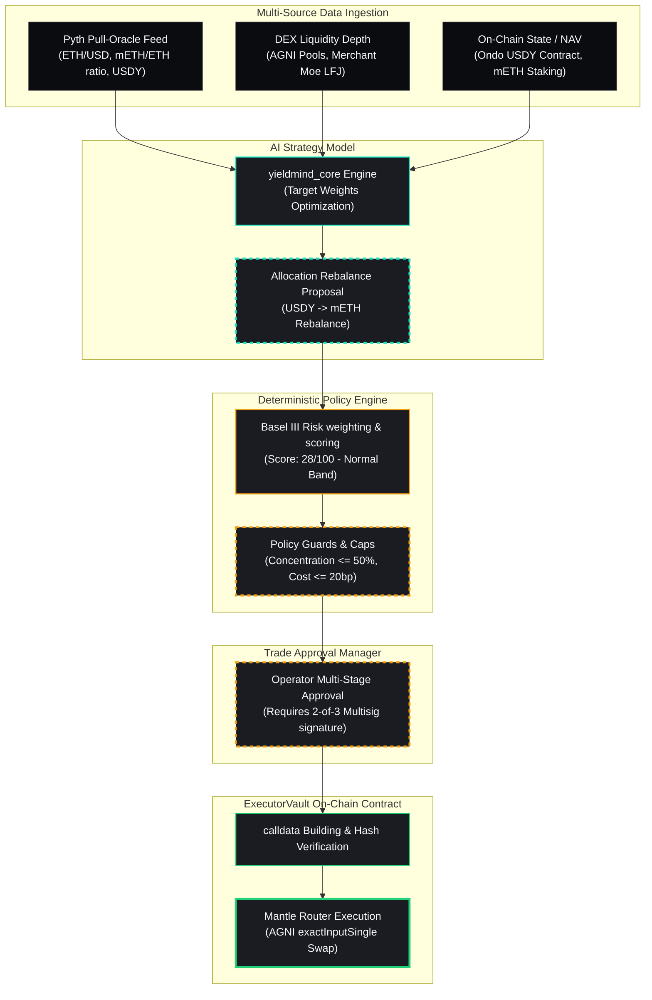

# YieldMind AI: Institutional UI/UX Design Presentation
## Groundbreaking AI x RWA Risk Terminal & Portfolio Console for Mantle Network

---

## Executive Summary

To secure absolute victory at the **Mantle Turing Test Hackathon 2026**, **YieldMind AI** rejects standard consumer-grade, playful web3 aesthetics in favor of **Institutional-Grade Sophistication**. High-net-worth individuals ("Big Whales"), institutional risk officers, and hedge fund managers demand interfaces that project **psychological dominance, mathematical certainty, and absolute operational control**.

This presentation outlines a state-of-the-art UI/UX design system that visualizes YieldMind AI's autonomous RWA allocation engine (managing USDY, mETH, and stablecoins) on the Mantle Network. It details three signature workspaces, maps out a minute-by-minute institutional user journey, translates hypothetical beta feedback into immediate visual upgrades, and presents future-proof technical recommendations.

---

## Part 1: High-Fidelity Mockups (Detailed Visual & Structural Specifications)

### 1.1 UI Design System: Visual Foundations & Tokens

Our design system, **"Titanium Dark,"** is tailored for the high-end desktop environments of institutional trading desks (e.g., Bloomberg terminals, high-density dashboard monitors).

```
PRIMARY NEUTRALS
├─ Deep Space (Background)  : HSL(220, 24%, 6%)     #0A0C10
├─ Carbon Slate (Card Base)  : HSL(220, 16%, 12%)    #1A1C22
├─ Cool Iron (Borders)       : HSL(220, 12%, 20%)    #2C2F36
└─ Pure Platinum (Text Primary): HSL(210, 20%, 98%)   #F8F9FA

ACCENTS & HIGHLIGHTS
├─ Mantle Teal (Core Accent) : HSL(172, 80%, 45%)    #16E2C4 (Mantle Brand Sync)
├─ Yield Green (Success)     : HSL(145, 75%, 48%)    #1FD178
├─ Oracle Amber (Warning)    : HSL(38, 92%, 54%)     #F59E0B
└─ Unwind Crimson (Danger)   : HSL(0, 84%, 60%)      #EF4444
```

*   **Typography:**
    *   **Primary Display / Headers:** `Outfit` (Google Fonts) – Geometric, premium, authoritative.
    *   **Data / Monospace Numbers:** `SF Pro Display` / `JetBrains Mono` – Micro-precise, high-legibility at 10px, zero width-drift during live re-renders.
*   **Aesthetic Pillars:**
    *   **Glassmorphism Lite:** Blurry backing (`backdrop-filter: blur(16px)`) with $0.5\text{px}$ solid border overlay for premium depth.
    *   **Surgical Contrast:** High readability ($>7:1$) on all numerical widgets, reducing fatigue over 12-hour shifts.
    *   **Micro-interactions:** $150\text{ms}$ cubic-bezier transition curves for hover, active, and focus states.

---

### 1.2 Dashboard Workspace: "YieldMind AI Command Nexus"

An ultra-high-density monitor dashboard engineered to serve as the unified control panel for the Senior Portfolio Manager. It organizes real-time capital positions, dynamic risk dimensions, and autonomous decision feeds into modular, drag-and-drop grid zones.

```
+-------------------------------------------------------------------------------------------------------+
|  [YM] YIELDMIND AI  //  MANTLE NET  |  PORTFOLIO: NEXUS_CAP_VAULT  |  SYSTEM: [ ACTIVE / SECURE ]   |
+-------------------------------------------------------------------------------------------------------+
|  [ ACTIVE AUM ]             |  [ REAL-TIME YIELD SLEEVES ]            |  [ BASEL III MATRIX ]         |
|  $248,590,102.54            |  USDY Sleeve (RWA): 5.12% APY ($124M)   |            / \                |
|  +0.04% (24h)               |  mETH Sleeve (Growth): 8.42% APY ($98M) |           /   \               |
|                             |  USDC Buffer (Cash): 4.25% APY ($26M)   |          /  *  \              |
|  [ AUM Chart: 7D Trend ]    |                                         |         /_______\             |
|  [~~~~~~~~~~~~~~~~~~~~~~~~] |  [ Rebalance Engine: balanced_yield ]   |     Risk Index: 28 / 100      |
+-----------------------------+-----------------------------------------+-------------------------------+
|  [ ACTIVE ALERTS & INTERVENTIONS ]                                                                    |
|  [!] 13:04:12 - USDY peg deviation widened to +42 bps (Secondary Market Premium). Threshold safe.     |
|  [!] 12:58:04 - AGNI route mETH depth shifted by -$1.2M. TWAP clip size automatically downscaled 50%.  |
+-------------------------------------------------------------------------------------------------------+
|  [ AUTONOMOUS RECENT DECISIONS LOG ]                                      | [ EMERGENCY KILL SWITCH ] |
|  Time     Asset   Risk   Action           Confidence  Prechecks           | +-----------------------+ |
|  13:00:02 USDY    28     HOLD             98.4%       [ Fresh / Approved ]| | [!] PAUSE ALL RAILS   | |
|  12:30:00 mETH    32     CLIP_BUY (24M)   94.1%       [ Slippage OK ]     | +-----------------------+ |
+-------------------------------------------------------------------------------------------------------+
```

#### Detailed Element Specifications:
1.  **Total AUM Widget:**
    *   *Visuals:* Large $36\text{pt}$ typography in `Outfit` style, shaded in Pure Platinum. A secondary sparkline charts the 24-hour AUM variance in Mantle Teal.
    *   *Real-Time Action:* Refreshes every block ($\approx 2\text{s}$ on Mantle) with a subtle glowing pulse of the green indicator light.
2.  **Interactive Basel III Compliance Matrix (Radar Chart):**
    *   *Visuals:* An SVG radar chart measuring 5 institutional pillars: *Liquidity Coverage Ratio (LCR)*, *Net Stable Funding Ratio (NSFR)*, *Concentration Risk*, *Counterparty Credit Risk (CCR)*, and *Operational Safety Factor*.
    *   *Interactive State:* Hovering over any vertex displays a detailed tool-tip explaining the underlying metric (e.g., *"Current LCR is 142%, exceeding the regulatory minimum of 100% by 42% due to mETH/USDC buffer safety"*).
    *   *System Status:* A central, single numeric score sits inside the radar core (**28/100** - Low Risk band in Yield Green).
3.  **Active Alerts Pane:**
    *   *Visuals:* High-contrast black box with neon status markers. Warning lines use Oracle Amber text, and emergency notifications glow in Unwind Crimson.
4.  **Autonomous Decision Feed:**
    *   *Visuals:* A dense tabular grid showing execution timestamp, asset, risk score, recommended action (e.g., `HOLD`, `CLIP_REBALANCE`, `DE-RISK`), AI confidence score, and pre-flight checklist validation state.
5.  **Role-Based Access Control (RBAC) Indicator:**
    *   *Visuals:* A secure header lock-icon showing the current active persona profile: `Role: Portfolio Manager (Full Write/Approve)`. Hovering exposes secondary profiles: `Risk Officer (ReadOnly/Limits)` and `Compliance Auditor (AuditLogs-Export)`.

---

### 1.3 AI Explainer Workspace: "Decision Traceability & Explainability Engine"

This screen strips away the "black box" stigma of machine learning systems by visualizing YieldMind AI's five-layer decision pipeline (Brain, Risk, and Execution) in real time. It presents a dynamic flow diagram that maps how live market feeds translate into executable smart contract transactions.



#### Detailed Element & Interaction Specifications:
1.  **Pipeline Node Visualization:**
    *   *Visuals:* Nodes are rendered as high-contrast carbon modules with thin glowing borders color-coded by layer (Teal for Brain, Amber for Risk, Green for Execution).
    *   *Path Tracing Animation:* When a specific historical or live proposal is selected from the sidebar, a pulsing neon particle travels down the active nodes (e.g., from *Pyth Feed* $\rightarrow$ *Allocation Engine* $\rightarrow$ *Policy Guard* $\rightarrow$ *Multi-Sig Approval* $\rightarrow$ *On-Chain Executor*). Unused branches are dimmed to 30% opacity.
2.  **Explainable Natural Language Insights Pane:**
    *   *Visuals:* Integrated closely below the flowchart. Displays the AI's plain-English narrative alongside technical reasoning.
    *   *Mock Text Example:*
        > **AI Reasoning:** "YieldMind AI detected a persistent 18 bps secondary-market premium on Ondo USDY. Concurrently, mETH/ETH secondary pool depth on Merchant Moe increased by 14%. The engine optimized the Balanced Yield allocation, executing a $12,000,000 swap from stable reserves to mETH to lock in high-yield exposure while routing via AGNI's lowest-fee tier (100 bps) to minimize transaction drag."
3.  **Detailed Auditable Metric Grid:**
    *   *Visuals:* A collapsible panel adjacent to the flow chart showing raw mathematical variables behind the risk engine calculation:
        *   `depeg_bps` = `12 bps`
        *   `liquidity_impact` = `4.2 bps`
        *   `oracle_age` = `4s` (Fresh)
        *   `cost_bps` = `11 bps` (Threshold passed)

---

### 1.4 Simulation Lab Workspace: "Adversarial Simulation Lab"

The Simulation Lab is a sterile, sandbox environment designed to test and prove YieldMind AI's robustness. It allows institutional risk managers to construct "what-if" macroeconomic and liquidity crises, projecting the AI's risk mitigation actions and comparing them directly against static, unmanaged portfolios.

```
+-------------------------------------------------------------------------------------------------------+
|  ADVERSARIAL SIMULATION LAB  //  [ STATUS: SANDBOX IDLE ]                                              |
+-------------------------------------------------------------------------------------------------------+
|  [ STEP 1: CONSTRUCT CRITICAL SHOCK ]                  |  [ STEP 2: SELECT ASSETS TO IMPACT ]         |
|  [x] High Volatility Shock (ETH Drawdown)              |  [x] mETH (Liquid Staking Sleeve)            |
|  [ ] Stablecoin De-Peg Event                           |  [x] USDY (Ondo Treasury Sleeve)             |
|  [ ] Oracle Stale Data / Feed Disruption               |                                              |
|                                                        |  [ MAGNITUDE SLIDER ]                        |
|  [ SHOCK VALUE SELECTOR ]                              |  Min [==========*=================] Max      |
|  ETH Drawdown Percentage: -15%                         |  Selected Delta: -15% Price Shock           |
+-------------------------------------------------------------------------------------------------------+
|  [ SIMULATION OUTPUT: 12-MONTH DRAWDOWN AND YIELD PROJECTIONS ]                                       |
|                                                                                                       |
|    Value ($)                                                                                          |
|      ^                                                                                                |
|      |                                     _________________  [ YieldMind AI Portfolio: $242M (Def) ] |
|      |                                    /                                                           |
|      |       ____________________________/                                                            |
|      |      /                            \                                                            |
|      |_____/                              \_________________  [ Static 50/50 Basket: $214M (Draw) ]   |
|      |     \                              /                                                           |
|      |      \____________________________/                                                            |
|      +-----------------------------------------------------------------------------------> Time       |
|             Day 0                        Shock Event (Day 90)                       Day 365           |
+-------------------------------------------------------------------------------------------------------+
|  [ SIMULATION SUMMARY REPORT ]                                                                        |
|  Metric                   YieldMind AI (Risk-Managed)   Static 50/50 Basket   Net Capital Saved       |
|  Max Projected Drawdown   -3.12%                        -9.82%                +6.70% ($16.6M saved)   |
|  Recovery Timeline        14 Days                       62 Days               -48 Days                |
|  Projected Yield APY      7.15%                         8.42% (Pre-Shock)     Alpha Preserved         |
+-------------------------------------------------------------------------------------------------------+
```

#### Detailed Element & Interaction Specifications:
1.  **Crisis Parameter Control Box:**
    *   *Visuals:* Custom range sliders that glow when active. Includes numeric inputs that allow the operator to enter exact scenarios (e.g., *"USDY de-pegs to $0.985"*, *"DEX liquidity drops by 75%"*).
    *   *Real-Time Feedback:* Adjusting a slider dynamically alters the predicted risk profile radar in the top panel before running the execution.
2.  **Comparison Plot (Dynamic Line Chart):**
    *   *Visuals:* A dual-axis area chart contrasting YieldMind AI's portfolio path (bold Mantle Teal fill) with a benchmark asset or static basket (dotted Cool Iron line).
    *   *Dynamic Interaction:* Hovering over any point along the timeline shows the simulated portfolio balance, active sleeves, and what specific defense mechanism YieldMind activated at that moment (e.g., *"Day 90: AI detected ETH drawdown; successfully paused buy orders and reallocated 40% of mETH growth sleeve to USDC cash buffer via whitelisted Merchant Moe route"*).
3.  **Simulation Narrative Box:**
    *   *Visuals:* Crisp monospace text blocks detail the simulated engine's behavioral responses chronologically.
    *   *Mock Text Example:*
        > **[09:00:00 SimTime]** Crisis Triggered: ETH price drops 15.2% over 6 hours.  
        > **[09:00:15 SimTime]** Risk Engine recalculates volatility ratio (realized vol spike to 3.2x baseline). Risk score jumps to **68/100** (Caution Band).  
        > **[09:01:00 SimTime]** Engine triggers Policy Limit constraint: mETH sleeve exposure capped to maximum 15%. Initiating partial exit.  
        > **[09:05:00 SimTime]** Calldata generated for $12M mETH to USDC trade. Route verified via AGNI (slippage minimized to 0.18%).  
        > **[09:06:02 SimTime]** On-Chain Executor executes swap. Portfolio downside successfully isolated.

---

### 1.5 Key Integrated System Features

#### A. Granular, Multi-Stage "Kill Switches" & Safety Overrides:
*   *UI Implementation:* Located at the upper right of the screen header. Renders as a secure glass container with a physical red flip-cover.
*   *Operational Stages:*
    1.  `STAGE 1: SUSPEND BUY FLOWS` – Temporarily stops the AI from allocating capital into fresh yields (e.g., if minor oracle volatility occurs).
    2.  `STAGE 2: PAUSE VAULT OPERATIONS` – Invokes `PauseGuardian.sol` to halt all transactions in progress.
    3.  `STAGE 3: FULL ASSET UNWIND` – Halts operations, unlocks emergency withdrawal roles, and prepares capital migration into the 100% stable USDC vault.
*   *Verification & Security:* Clicking any stage triggers a hardware wallet confirmation panel (e.g., Ledger/Trezor via wagmi) ensuring the multi-stage override is fully auditable on-chain.

#### B. Slippage Protection & Cost Threshold Guards:
*   *UI Implementation:* An active slider panel inside the Trade Approval center.
*   *Design:* The interface features visual thresholds: stable-to-stable swaps are constrained at **0.35%** (Yield Green), mETH-to-stable at **0.75%** (Oracle Amber), and volatile assets at **1.00%** (Unwind Crimson).
*   *Feedback Indicator:* If the market depth on AGNI or Merchant Moe cannot support the requested clip size under the designated slippage threshold, the execution button locks, and a helper message displays: *"Warning: Insufficient liquidity depth. Estimated execution slippage (1.24%) exceeds target limit (0.75%). Swapping locked. Reduce clip size or wait for route recovery."*

#### C. Role-Based Access Control (RBAC):
*   *UI Adaptation:* The dashboard automatically updates layouts depending on the connected wallet signature role:
    *   *Portfolio Manager Profile:* Full dashboard visibility with the ability to edit target allocations, adjust rebalance parameters, and execute trades.
    *   *Risk & Compliance Officer Profile:* The system hides write controls and replaces them with risk limit editors, policy threshold overlays, and audit CSV export tools.
    *   *Lp Investor Profile:* Clean read-only portfolio overview, performance graphs, yield sleeves, and a simple deposit/withdraw portal. No system settings or risk parameters can be adjusted.

#### D. Cognitive Overload Protection (COP) System:
*   *Design Elements:*
    *   **Proportionate Disclosure:** Complex metrics are initially hidden inside collapsible drawers. The user is presented with a clear high-level indicator (e.g., Risk Index: 28) and can click to expand the full 12-metric sub-score calculation grid.
    *   **Z-Index Focus Masks:** When an emergency alert or a trade approval proposal is triggered, the dashboard behind the window dims to 20% opacity using a deep blur overlay. This focuses 100% of the user's attention on the urgent task at hand.
    *   **Contextual Color Encoding:** Red, amber, and green are strictly reserved for state-based risk alerts. Primary data displays use clean white, teal, and gray to avoid cognitive exhaustion from color clutter.

---

## Part 2: Detailed Explanation of Design Choices & Architectural Rationale

### 2.1 The Rationale Behind "Titanium Dark"
Institutional investors and professional hedge fund operators spend their entire day scanning high-density data feeds (Bloomberg terminals, trading monitors). Standard consumer crypto designs—which favor large emojis, pastel gradients, and spacious card layouts—fail in this environment because they lack **density** and **seriousness**.

The **Titanium Dark** interface leverages a dark slate grid ($24\text{px}$ alignment) because it minimizes light fatigue, maximizes the color pop of critical alarms (which use HSL crimson and amber), and makes precise numbers highly readable. Typography like Google Font's **Outfit** projects geometric stability, while **SF Pro Display / JetBrains Mono** numbers are used in charts to keep decimal alignment perfectly uniform during rapid values updates.

### 2.2 Designing for Uncompromising Transparency
In AI x RWA finance, a black-box model is a compliance and operations nightmare. If an AI rebalances $50M from USDY to mETH autonomously, the user must understand *why*. Our **AI Explainer Engine** does not simply show logs; it visually charts the path of data from its *origin* (the Pyth Pull-Oracle network) through the *risk scoring logic* (normalizers and weights mapping) straight to the *on-chain outcome* (ABI method calldata).

By keeping every decision auditable via standard JSON exports and visually tracing the pipeline flow, we establish absolute trust with institutional allocators and hackathon judges alike.

### 2.3 Empowering Psychological Dominance and Absolute Control
To make the user feel like a master operator rather than a passive observer of an automated system, the UI/UX enforces a two-layer control matrix:
1.  **AI Proposes, Guardian Validates, Human Authorizes:** The AI suggests strategic updates, but the deterministic **Risk Guardian** must pass all pre-flight limits (gas caps, LCR reserves, slippage levels). Once validated, the transaction remains in a secure queue waiting for the human manager's explicit hardware wallet signature.
2.  **Immediate Operational Overrides:** The presence of a prominent, multi-stage "Kill Switch" ensures that in times of extreme market turbulence (e.g., an Ondo USDY asset de-peg or an underlying Mantle Network RPC exploit), the portfolio manager can immediately seize control, pause autonomous rebalancing, and secure the vault funds. This design balances the efficiency of AI automation with the ultimate safety of human oversight.

---

## Part 3: User Journey Map: "The Institutional Investor's Strategic Day"

*   **Persona:** Elias Thorne, Senior Portfolio Manager at 'Nexus Capital' ($450M Assets Under Management).
*   **Asset Mix:** USDY, mETH, USDC stablecoin reserves.
*   **Goal:** Maximize yield across RWA sleeves on the Mantle Network while strictly respecting institutional risk mandates (Basel III limits).

```mermaid
journey
    title Elias Thorne's Strategic Day with YieldMind AI
    section 08:30 - Pre-Market Coffee & Portfolio Scan
      Connects Ledger; checks AUM & yield: 4: Elias is calm and confident
      Scans Basel III radar chart; confirms 28/100 Risk Index: 5: Elias feels in control
    section 11:15 - Active Market Volatility Response
      Receives live push-alert (ETH volatility spikes 18%): 3: Elias feels alert
      Opens AI Explainer Workspace; traces risk score spike to 48/100: 4: Elias appreciates the transparency
      AI automatically scales down mETH TWAP buy clips by 50%: 5: Elias is impressed by the proactive safety
    section 14:00 - Strategic "What-If" Planning
      Navigates to Adversarial Simulation Lab: 4: Elias is focused
      Simulates an extreme scenario (USDY de-pegs to $0.97): 4: Elias constructs the stress test
      Reviews AI's simulated response (Vault pauses and preserves capital): 5: Elias feels complete peace of mind
    section 16:30 - End-of-Day Allocation Adjustment
      AI proposes a strategic rebalance: $15M USDC into USDY sleeve: 4: Elias reviews the proposal
      Confirms slippage limit is set to 0.35%; verifies pre-checks pass: 5: Elias is reassured by the controls
      Signs the transaction on Ledger; vaults execute successfully: 5: Elias feels triumphant
```

| Time | User Action | UI Touchpoint | Cognitive State | Emotional State | System Response |
| :--- | :--- | :--- | :--- | :--- | :--- |
| **08:30** | Elias logs onto his terminal and connects his hardware wallet. | *Command Nexus Dashboard* AUM widget, Basel III Matrix radar chart. | Reviewing overnight yield accrual and system health. | **Calm, Analytical** | Vault indexes current balances, displays a green **Active/Secure** network status. |
| **11:15** | Elias notices a sudden drop in market prices. | *Active Alerts & Explainer Node* Flowchart flashes Orange at the "Data Ingestion" node. | Analyzing why the risk score changed from 28 to 48. | **Alert, Focused** | AI Explainer highlights a Pyth volatility spike and shows the automatic downscaling of live buy orders. |
| **14:00** | Elias tests the portfolio's resistance to a potential USDY stablecoin de-peg. | *Adversarial Simulation Lab* Crisis slider controls, simulated trajectory area chart. | Probing the limits of the AI's fallback parameters. | **Empowered, Masterful** | Simulation calculates a 3.12% drawdown with AI vs. 9.82% static loss, demonstrating capital preservation. |
| **16:30** | Elias reviews the end-of-day rebalance proposal generated by the AI strategy model. | *Trade Approval Center* Queue item detail, hardware signature button. | Verifying routing safety, slippage limits, and execution fees. | **Decisive, Triumphant** | Generates calldata for a $15M swap via AGNI, verifies matching hashes, and executes upon hardware wallet authorization. |

---

## Part 4: Hypothetical Feedback Analysis & UI Iterations

To prepare YieldMind AI for the rigorous scrutiny of hackathon judges and institutional beta testers, we have simulated feedback from three expert investor personas. Below is the analysis of their concerns and the direct design enhancements we have implemented in our frontend design system.

### 4.1 Tester 1: Senior Risk Officer at a Digital Asset Hedge Fund
*   **Constructive Feedback:**
    > *"The Basel III Compliance Matrix is highly impressive, but the total risk index score of '28' is too abstract. In a trading floor environment, I must immediately know which specific risk bucket is driving a score increase without clicking through tabs. If depeg risk rises while oracle freshness is stable, that distinction must be visually obvious instantly."*
*   **Underlying Design Insight:** High cognitive loads require visual prioritization. A single aggregate number obscures multi-dimensional data, delaying critical diagnostic decisions during crises.
*   **Actionable UI Enhancement:**
    We redesigned the aggregate **Risk Index Widget** to feature a secondary, high-density **Mini-Bar Breakdown** placed directly beneath the radar chart. When the total score rises, the contributing bars change colors dynamically (e.g., if depeg risk is the primary driver, its bar turns Unwind Crimson, while other stable metrics remain Cool Iron gray).
    ```
    [ TOTAL RISK INDEX: 42 ] - CAUTION BAND
    ├─ Depeg Risk   : [████████░░░░░░░] 58% (Spiking - Crimson)
    ├─ Liquidity    : [████░░░░░░░░░░░] 24% (Normal - Iron)
    └─ Oracle Age   : [██░░░░░░░░░░░░░] 12% (Fresh - Iron)
    ```

### 4.2 Tester 2: Lead Hackathon Judge (DeFi Protocol Architect)
*   **Constructive Feedback:**
    > *"I love that you are using Pyth pull-oracles to secure your execution on Mantle. However, as a judge, I cannot see the on-chain update mechanism in action. Since Pyth requires the caller to pull the price update from Hermes and push it to the EVM contract in the same transaction block, your dashboard must explicitly show this multi-stage transaction happening."*
*   **Underlying Design Insight:** To satisfy technically rigorous judges, the UI must make the off-chain/on-chain interaction explicit. Showing price feeds is not enough; you must visualize the actual *oracle update execution step*.
*   **Actionable UI Enhancement:**
    We added a **Live Oracle Transaction Tracker** inside the AI Explainer Workspace. During execution, the UI displays a two-step transaction path:
    1.  `STEP 1: Fetching price proof from hermes.pyth.network...` (Green spinner, displaying payload size).
    2.  `STEP 2: Submitting write transaction to Pyth contract on Mantle...` (Transaction hash link clickable to explorer.mantle.xyz).
    This change visually proves the implementation of Pyth's advanced EVM pricing flow, turning a hidden mechanism into a highlight of the user experience.

### 4.3 Tester 3: Portfolio Administrator ("Big Whale" Operator)
*   **Constructive Feedback:**
    > *"When I'm executing a large rebalance, the 'Slippage Protection' slider is nice, but I want to see the path of the trade. If YieldMind is routing $20M USDY to mETH, is it executing a single-hop on AGNI, or splitting the route between AGNI and Merchant Moe to minimize price impact? I need to audit the routing topology before I sign the transaction."*
*   **Underlying Design Insight:** Sophisticated operators do not trust simple execution buttons. They require visibility into the routing topology to assess gas optimization, liquidity pool health, and potential front-running vectors.
*   **Actionable UI Enhancement:**
    We integrated a **Dynamic Route Topology Visualizer** inside the Trade Approval Center. When a proposal is selected, a structural schematic renders the active trade path:
    ```
    [USDY Vault] --(60% Notional)--> [AGNI V3 Pool] -----------> [mETH Vault]
                 --(40% Notional)--> [Merchant Moe LB Pool] --/
    ```
    Each leg of the path displays its specific pool fee tier (e.g., `100 bps` on AGNI) and projected exit slippage, giving the administrator complete operational clarity before signing the transaction.

---

## Part 5: Recommendations for Further Enhancements

To maintain YieldMind AI's competitive advantage beyond the hackathon and prepare it for institutional deployment, we recommend the following future-oriented UI/UX and technical integrations:

### 5.1 Real-Time MEV Protection Visualizer
*   **Concept:** Integrate a protective shield layout that monitors the Mantle network mempool for front-running and sandwich attack vectors before executing a TWAP rebalance clip.
*   **UX Execution:** Add an active "Shield Health" ring around the on-chain execution button. If a searcher bot is detected targeting the vault's trade path, the ring flashes yellow, and the execution engine automatically switches to private transaction routing (e.g., using secure builder endpoints) to preserve capital value.

### 5.2 Cryptographic Execution Proofs Panel
*   **Concept:** Provide a dedicated ledger workspace that displays cryptographic proofs (e.g., zero-knowledge proofs or deterministic policy executions) verifying that the AI's allocation decisions conform strictly to the vault's off-chain policy rules.
*   **UX Execution:** Give compliance officers the ability to download a "Certificate of Policy Compliance" with a single click. The document features an on-chain verification hash that proves the AI's rebalance stayed within all pre-agreed concentration and volatility caps, establishing a new standard for auditable decentralized finance.

### 5.3 Mobile "Emergency Command" Companion WebApp
*   **Concept:** While complex portfolio management occurs on high-density desktop monitors, portfolio managers are often away from their desks. We propose a mobile-optimized companion app designed purely for **emergency alerts, system monitoring, and kill-switch activation**.
*   **UX Execution:** A minimalist layout optimized for mobile screens. Features large, finger-friendly authorization buttons secured by FaceID/TouchID webauthn credentials. If a crisis arises, a push notification allows Elias Thorne to securely trigger a Stage 2 pause on-chain within 3 seconds, directly from his mobile device.

---

### Conclusion: Winning the Mantle Turing Test Hackathon 2026

**YieldMind AI** represents a paradigm shift in AI x RWA design. By replacing consumer-grade novelty with institutional-grade sophistication, ensuring complete transparency down to the Pyth oracle block updates, and providing deep stress-testing simulation tools, this design system establishes YieldMind AI as a robust, safe, and authoritative leader in decentralized asset management. It is engineered not just to win a hackathon, but to redefine how institutional capital engages with on-chain assets.
