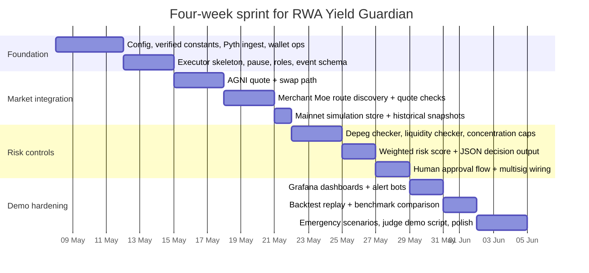

# RWA Yield Guardian on

## Executive summary

The highest-confidence MVP path is to build RWA Yield Guardian for **secondary-market execution on Mantle mainnet**, not issuer-side mint/redeem flows. The core contracts and endpoints that are already well-documented are the Mantle mainnet and Sepolia network endpoints, the mainnet address for USDY, the mainnet and Sepolia addresses for mETH, the live router/factory contracts for Merchant Moe and AGNI, and the Pyth contracts for both mainnet and Sepolia. citeturn47view1turn47view2turn5view0turn10view0turn15view0turn20view0turn21view0turn43view2turn43view1

The main implementation risk is **not** basic connectivity; it is **risk control**: depeg detection, liquidity-aware routing, stale-oracle protection, contract pause logic, and clear human override. That is especially important because USDY itself warns that holders may incur losses, including total loss of purchase price, and because mETH is a value-accruing staking token whose accounting is updated through protocol/oracle processes rather than a fixed peg. citeturn22search3turn8view1turn10view0

For the hackathon, the safest and most demo-friendly design is therefore: **monitor continuously, score risk transparently, trade only in small guarded slices, and require human approval for emergency or non-routine actions**. In practice that means hardcoding only the **verified core contracts**, discovering pool addresses dynamically from factories/quoters at runtime, and using Sepolia mainly to test your executor, risk engine, and pause flows rather than to claim full economic realism. citeturn15view0turn20view0turn21view0turn41search12turn42view2

The main gaps I could not close from high-confidence primary material are: a current primary-source table of **direct USDY/mETH pool addresses**, a current primary-source table of **all canonical Sepolia token equivalents** for USDC/WETH/WMNT, and the **full, official Pyth stable feed IDs** for USDY and mETH from the accessible excerpts. Those should be treated as **runtime-discovered or pre-launch-verified**, not hardcoded from memory. citeturn22search0turn46search1turn46search0

## Core integration choices

The best architecture choice is to split the system into two environments.

On **mainnet**, execute real swaps and rebalances using verified token addresses, verified oracle contracts, and verified routers. The official materials captured here show Mantle mainnet RPC `https://rpc.mantle.xyz`, chain ID `5000`, explorer `https://explorer.mantle.xyz`, a Mantlescan instance, the USDY mainnet contract, the mETH Mantle L2 mainnet contract, Merchant Moe routers, AGNI router/factory deployments, and the Pyth mainnet contract. citeturn47view1turn48search3turn28search20turn5view0turn10view0turn15view0turn20view0turn43view2

On **Mantle Sepolia**, test your executor contract, off-chain decision logic, and emergency controls. Mantle’s own Sepolia announcement provides the faucet, bridge, and explorer, and official Pyth docs provide the Sepolia contract address. The mETH protocol docs also publish a Mantle Sepolia L2 token address. However, the official sources I captured do **not** give a clean, primary-source table for a current Sepolia USDY deployment or for all canonical Sepolia USDC/WETH/WMNT helper tokens. Mantle’s Sepolia announcement also notes that L2 MNT is a **native token**, not an ERC-20 first-class contract by default, which is one reason to avoid over-assuming wrapped-token parity with mainnet. citeturn47view2turn43view1turn10view0

Because of that, the cleanest hackathon scoping is:

- **Mainnet**: market data, pool discovery, quote simulation, and optionally small real trades.
- **Sepolia**: contract deployment, price-update plumbing, execution guards, pause/unpause, failed-trade handling, and human approval UX.
- **Mocks/local fork**: MockUSDY, mock stable oracles, and deterministic low-liquidity scenarios for demoing emergency controls.

That separation keeps the demo technically rigorous without pretending that every market and token rail is fully mirrored on Sepolia. citeturn47view2turn22search0turn41search12turn42view2

A second important design choice is **what to hardcode** versus **what to discover**.

| Category | Recommendation | Why |
|---|---|---|
| Network constants | Hardcode | Chain IDs, core RPCs, core explorers, Pyth contract addresses, and verified token addresses are stable enough for config files. citeturn47view1turn47view2turn43view2turn43view1turn5view0turn10view0 |
| Routers/factories/quoters | Hardcode | These are protocol entry points and are published in official docs/repos. citeturn15view0turn20view0turn21view0 |
| Pair / pool addresses | Discover at runtime | Official docs captured here do not publish a definitive pair table for USDY/mETH routes. Discover from factory + quoter, then cache. citeturn22search0turn15view0turn20view0 |
| Latest prices | Pull every cycle | Pyth on EVM is a pull-oracle flow; freshness must be enforced by your own update/age checks. citeturn41search12turn42view2 |
| Historical prices | Store yourself | The captured official excerpts clearly document latest/streaming flows, but not a fully worked historical endpoint for your exact use case. Build your own time-series store from ingested updates. citeturn42view1turn42view2 |

## Verified addresses and endpoints

The table below separates **high-confidence verified constants** from items that remain **ambiguous and should be runtime-discovered or manually verified once more before launch**.

| Item | Mainnet | Sepolia / testnet | Source and verification note |
|---|---|---|---|
| Network chain ID | `5000` | `5003` | `5000` is published in Mantle’s onboarding guide; `5003` is shown on Chainlist for Mantle Sepolia. urlMantle onboarding guideturn47view1 urlChainlist Mantle Sepoliaturn48search1 citeturn47view1turn48search1 |
| Public RPC | `https://rpc.mantle.xyz` | `https://rpc.sepolia.mantle.xyz` | Mainnet RPC is published by Mantle; Sepolia RPC is shown by Chainlist and used across Mantle ecosystem materials. urlMantle onboarding guideturn47view1 urlChainlist Mantle Sepoliaturn48search1 citeturn47view1turn48search1 |
| Explorer | `https://explorer.mantle.xyz` and `https://mantlescan.xyz` | `https://explorer.sepolia.mantle.xyz` | Mantle publishes the explorer in its docs/blog; Chainlist also surfaces the explorer list. Mantlescan is live for mainnet and also exposes a Sepolia switch in its UI. urlMantle onboarding guideturn47view1 urlMantle Sepolia announcementturn47view2 urlChainlist Mantle mainnetturn28search9 urlMantlescan WETH pageturn35view0 citeturn47view1turn47view2turn28search9turn35view0 |
| Faucet | — | `https://faucet.sepolia.mantle.xyz/` | Published in Mantle’s Sepolia announcement. urlMantle Sepolia announcementturn47view2 citeturn47view2 |
| Bridge | Mainnet bridge referenced in onboarding flow | `https://bridge.sepolia.mantle.xyz/` | Mantle’s mainnet onboarding guide shows bridge usage; Sepolia bridge is explicit in the Sepolia announcement. urlMantle onboarding guideturn47view1 urlMantle Sepolia announcementturn47view2 citeturn47view1turn47view2 |
| USDY | `0x5be26527e817998a7206475496fde1e68957c5a6` | **No official Sepolia USDY deployment found in the captured primary sources** | This mainnet address appears on the official Ondo contract-address page under Mantle. For testnet, use a `MockUSDY` plus mock NAV/depeg oracle. urlOndo contract addressesturn5view0 citeturn5view0 |
| mETH | `0xcDA86A272531e8640cD7F1a92c01839911B90bb0` | `0x9EF60874d4c5d57E7361F564b9cA86056fDf5B89` | Published on the mETH protocol contracts page for Mantle L2 mainnet and Mantle L2 Sepolia. urlmETH contracts pageturn10view0 citeturn10view0 |
| WMNT | `0x78c1b0C915c4FAA5FffA6CAbf0219DA63d7f4cb8` | **Current official Sepolia canonical WMNT not clearly published in captured primary docs** | Mainnet WMNT is present in AGNI’s official deployment material and SDK config. On Sepolia, favor native MNT flows unless you explicitly verify a wrapper contract. urlAGNI mainnet deployment JSONturn20view0 urlAGNI SDK repoturn40view0 urlMantle Sepolia announcementturn47view2 citeturn20view0turn40view0turn47view2 |
| WETH | `0xdEAddEaDdeadDEadDEADDEAddEADDEAddead1111` | **Not confirmed from primary captured Sepolia docs** | Mainnet WETH is labelled on Mantlescan as the Mantle WETH token. For Sepolia, verify before use; do not assume parity blindly. urlMantlescan WETH pageturn35view0 urlAGNI SDK repoturn40view0 citeturn35view0turn40view0 |
| USDC | `0x09Bc4E0D864854c6aFB6eB9A9cdF58aC190D0dF9` | **Not confirmed from primary captured Sepolia docs** | Mainnet USDC is labelled on Mantlescan and appears in AGNI’s SDK config. For Sepolia, if you need a stablecoin rail, prefer a mock unless you verify an explorer-labelled contract yourself. urlMantlescan USDC pageturn30search1 urlAGNI SDK repoturn40view0 citeturn30search1turn40view0 |
| Pyth price-feed contract | `0xA2aa501b19aff244D90cc15a4Cf739D2725B5729` | `0x98046Bd286715D3B0BC227Dd7a956b83D8978603` | Official Pyth EVM contract-address list. urlPyth EVM contract addressesturn42view0 citeturn43view2turn43view1 |
| Merchant Moe classic router | `0xeaEE7EE68874218c3558b40063c42B82D3E7232a` | Not captured | Official Merchant Moe contracts page. urlMerchant Moe contractsturn15view0 citeturn15view0 |
| Merchant Moe LB Router | `0x013e138EF6008ae5FDFDE29700e3f2Bc61d21E3a` | Not captured | Official Merchant Moe contracts page; use this for Liquidity Book routing. urlMerchant Moe contractsturn15view0 citeturn15view0 |
| Merchant Moe LFJ Aggregator Router | `0x45A62B090DF48243F12A21897e7ed91863E2c86b` | Not captured | Official Merchant Moe contracts page. urlMerchant Moe contractsturn15view0 citeturn15view0 |
| Merchant Moe factory | `0x5bef015ca9424a7c07b68490616a4c1f094bedec` | Not captured | Official Merchant Moe contracts page. Useful for classic pair discovery. urlMerchant Moe contractsturn15view0 citeturn15view0 |
| Merchant Moe LB factory | `0xa6630671775c4EA2743840F9A5016dCf2A104054` | Not captured | Official Merchant Moe contracts page. Useful for LB pair discovery. urlMerchant Moe contractsturn15view0 citeturn15view0 |
| AGNI factory | `0x25780dc8Fc3cfBD75F33bFDAB65e969b603b2035` | `0xA9AcD50B042A72c33d05fDcC8ad209d3aD361762` | Official AGNI deployment JSON files in the protocol repo. urlAGNI mainnet deployment JSONturn20view0 urlAGNI Sepolia deployment JSONturn21view0 citeturn20view0turn21view0 |
| AGNI swap router | `0x319B69888b0d11cEC22caA5034e25FfFBDc88421` | `0xe38cfa32cCd918d94E2e20230dFaD1A4Fd8aEF16` | Official AGNI deployment JSON files in the protocol repo. urlAGNI mainnet deployment JSONturn20view0 urlAGNI Sepolia deployment JSONturn21view0 citeturn20view0turn21view0 |
| AGNI quoter / quoterV2 | `0x9488C05a7b75a6FefdcAE4f11a33467bcBA60177` / `0xc4aaDc921E1cdb66c5300Bc158a313292923C0cb` | `0xA82F8dC4704d3512b120de70480219761F24B6Eb` / `0x9Da17239a4170f50A5A2c11813BD0C601b5c9693` | Official AGNI deployment JSON files in the protocol repo. urlAGNI mainnet deployment JSONturn20view0 urlAGNI Sepolia deployment JSONturn21view0 citeturn20view0turn21view0 |

### Pool discovery and liquidity lookup

I did **not** find a primary-source, protocol-published table of direct **USDY/mETH** pool addresses. What I did find is that Mantle’s own ecosystem content points to active mETH pools, including Merchant Moe mETH/WETH-type liquidity, and mentions an mETH/USDY pool on another Mantle DEX. That is good enough to justify **runtime route discovery**, but not good enough to justify hardcoding a direct USDY/mETH pool address into production config. citeturn22search0

The safe pattern is:

```ts
// AGNI / Uniswap V3-style discovery
const candidateFees = [100, 500, 3000, 10000];
for (const fee of candidateFees) {
  const pool = await agniFactory.getPool(tokenA, tokenB, fee);
  if (pool !== ZERO_ADDRESS) {
    const quote = await agniQuoterV2.quoteExactInputSingle({
      tokenIn: tokenA,
      tokenOut: tokenB,
      amountIn,
      fee,
      sqrtPriceLimitX96: 0
    });
  }
}
```

```ts
// Merchant Moe discovery pattern
// Classic AMM: query MoeFactory pair
// Liquidity Book: enumerate supported binSteps and query LBFactory
const pair = await moeFactory.getPair(tokenA, tokenB);
// or
const info = await lbFactory.getLBPairInformation(tokenA, tokenB, binStep);
```

This is the right engineering trade-off because both official contract pages give you the **factories/routers/quoters**, but not the full market-pair table you need for a static allowlist. citeturn15view0turn20view0

For indexing, I did **not** confirm a public official subgraph endpoint for AGNI or Merchant Moe in the materials captured here. The reliable fallback is to deploy your own indexer: Mantle has published guides for deploying subgraphs to its Graph node and for using 0xgraph indexing on Mantle. urlMantle subgraph guideturn14search6 urlMantle 0xgraph guideturn14search15 citeturn14search6turn14search15

### Pyth and Hermes integration

For prices, the high-confidence constants are the **mainnet** Pyth contract `0xA2aa...5729`, the **Sepolia** Pyth contract `0x9804...8603`, and the full stable ETH/USD feed ID:

```text
ETH/USD = 0xff61491a931112ddf1bd8147cd1b641375f79f5825126d665480874634fd0ace
```

That feed ID is shown directly in Pyth’s Hermes documentation example. citeturn42view1turn43view2turn43view1

Example price-fetch flow:

```bash
# Latest price update from Hermes
curl "https://hermes.pyth.network/v2/updates/price/latest?ids[]=0xff61491a931112ddf1bd8147cd1b641375f79f5825126d665480874634fd0ace"
```

```solidity
bytes[] memory updateData = ...;                // from Hermes
uint256 fee = pyth.getUpdateFee(updateData);
pyth.updatePriceFeeds{value: fee}(updateData);
PythStructs.Price memory px = pyth.getPriceNoOlderThan(ETH_USD_ID, 60);
```

Pyth’s official EVM docs explicitly describe this pull-oracle flow: fetch update data from Hermes, pay `getUpdateFee`, call `updatePriceFeeds`, then read the price on-chain. citeturn41search12turn42view2

For **USDY** and **mETH**, the official Pyth excerpts I captured are only **partial**:

- Pyth Core clearly lists **USDY/USD** and **USDY/USD.RR** feeds; the accessible snippet shows the stable USDY/USD ID beginning `0xe393...` and ending `0e7326`, and a ratio-style USDY/USD.RR feed beginning `0xe3d1...` and ending `28d500`. citeturn44search1turn46search1
- Pyth Core also shows **METH/ETH.RR**, with a stable feed beginning `0xee279e...` and ending `88727e`. A direct **METH/USD** row also appears to exist on the Pyth feed page, but I could not reliably recover the full ID from the accessible excerpts. citeturn46search0turn46search3

My recommendation is therefore:

- Use **ETH/USD** from Pyth immediately.
- For **mETH/USD**, compute `mETH/USD = ETH/USD × mETH/ETH ratio` until you verify the direct METH feed from the live Pyth feed list or Hermes symbols endpoint.
- For **USDY**, monitor both **secondary-market price** and **peg deviation versus 1.00**, but verify the full Pyth feed ID live before deployment.
- Also maintain your **own historical store** of all ingested Pyth updates, because the official excerpts captured here document latest/streaming flows clearly, but not a fully worked historical endpoint for your exact implementation path. citeturn42view1turn42view2turn46search1turn46search0

### RPC providers and verification tooling

The two managed providers I could verify with confidence in captured material are:

- urlQuickNodehttps://www.quicknode.com/ — Mantle docs pages and API overview are live, and the pricing page is published. citeturn49search5turn49search17turn49search1
- urlInfurahttps://www.infura.io/ — Mantle support is published as **Open Beta** via DIN, and the Mantle reference warns that feature limitations are possible while the service stabilises. citeturn49search2turn49search10

I did **not** verify a Mantle-specific managed endpoint from urlAlchemyhttps://www.alchemy.com/ in the captured official sources, and I did not verify a Mantle-specific production offering from urlChainstackhttps://chainstack.com/ in the captured sources either. So the safest recommendation is:

- **Primary**: public Mantle RPC for development.
- **Production fallback / scaling**: QuickNode first; Infura as a beta alternative.
- **Do not** hardcode pricing assumptions into the app, because provider plans and request limits can move; read them live during procurement. citeturn49search1turn49search10

For contract verification, Mantlescan’s developer menu exposes **API Documentation** and **Verify Contract**, and Mantle’s tutorial repository explicitly includes a “How to verify Contracts via Explorer” guide. That is enough to support either explorer-UI verification or an Etherscan-compatible CI step for mainnet deployments. citeturn35view0turn34search17

## Risk taxonomy and scoring

The table below is the practical control surface for the MVP. The thresholds are **recommended defaults for your hackathon build**, not protocol-imposed limits.

| Risk type | What it means | Metrics to watch | Default automated rule | Data source / module |
|---|---|---|---|---|
| Depeg risk | USDY trades away from expected dollar value or mETH trades away from its fair ETH-linked value | `abs(price-1.00)` for USDY; `mETH/ETH` discount vs 7d mean; Pyth confidence interval | Warn at `>0.30%` for 30 min; reduce exposure at `>0.75%`; pause fresh buys at `>1.50%` | `depeg_checker`, Pyth, DEX quotes |
| Liquidity risk | You cannot enter/exit without moving price too much | Pool TVL, 1% depth, route capacity, quote impact | Do not trade if order size exceeds `25%` of 1% depth or `5%` of pool TVL | `liquidity_checker`, factory/quoter, self-indexer |
| Counterparty / custodian risk | Asset depends on issuer, custodians, trustees, banking rails | Issuer announcements, attestation freshness, abnormal redemption restrictions | Human approval only for any issuer/legal event; no autonomous enlarge after adverse issuer signal | `risk_engine`, issuer watcher |
| Regulatory / eligibility risk | Transfer or redemption rights may depend on jurisdiction/KYC | Jurisdiction flags, sanctions screen, wallet allowlist | Block issuer-side actions unless wallet/user is pre-approved; secondary-market only for MVP | `policy_guard`, backend KYC flag |
| Smart-contract risk | Bug, exploit, unexpected upgrade, pause, or admin abuse | Upgrade events, proxy admin changes, pause state, audit age | Human approval after any upgrade/admin change; pause routes touching changed contracts | `contract_watcher`, explorer logs |
| Oracle / data risk | Prices stale, confidence too wide, or update not pushed on-chain | Price age, confidence, missing sample count | Reject trade if age `>120s` for ETH or `>300s` for stables; reject if confidence `>0.30%` on stables | `oracle_guard`, Pyth/Hermes |
| Market / volatility risk | Underlying ETH volatility changes trade timing risk | 1h/24h realised vol, gap moves, drawdown | Shrink clip size by 50% if 24h vol > `2x` 30d median | `market_monitor` |
| Interest-rate risk | Treasury/yield changes affect tokenized-yield products | 2Y/10Y UST moves, benchmark yield spread | No rebalance into RWA leg on macro days with `>25bp` benchmark shock without human sign-off | `macro_watcher` |
| Basis risk | Secondary-market token price diverges from fair NAV / conversion logic | USDY price vs assumed 1.00; mETH/ETH ratio vs expected accrual path | Treat persistent basis `>50bp` as risk, not opportunity, until liquidity confirms exit path | `basis_checker` |
| Settlement / operational risk | Approvals, nonce issues, bridge issues, RPC failures | Failed tx rate, pending age, retry count, RPC error rate | Switch to simulation-only mode if failed tx rate > `5%` in 15 min or pending age > `180s` | `executor`, `rpc_health` |
| Concentration risk | Too much exposure to one asset, issuer, DEX, or pool | Per-asset %, per-DEX %, per-pool %, single-counterparty % | Cap at `35%` per asset, `50%` per issuer, `40%` per DEX route | `portfolio_limits` |
| Slippage risk | Realised output meaningfully worse than quoted output | quoted vs realised output, pre/post trade mid-price | Hard fail above `0.35%` on stable-to-stable, `0.75%` on stable-to-mETH, `1.00%` on mETH-to-ETH | `transaction_builder` |
| Funding / gas risk | Gas or fee conditions make small trades uneconomic | gas price, estimated fee in bps of trade size | Skip execution if estimated total cost > `20bp` of intended trade notional | `fee_guard` |

A robust explainable score is:

\[
\text{riskScore} = 100 \times \sum_i w_i \cdot s_i
\]

where `w_i` is the configurable weight for each risk bucket and `s_i ∈ [0,1]` is a normalised subscore. A good default weighting for this MVP is:

- depeg `0.20`
- liquidity `0.15`
- counterparty/custodian `0.15`
- smart-contract `0.10`
- oracle/data `0.10`
- market volatility `0.10`
- interest-rate/basis `0.075`
- settlement/operational `0.05`
- concentration `0.05`
- gas/funding `0.025`

Use a piecewise normaliser so the score is explainable:

```python
def normalise(x, warn, kill):
    if x <= warn:
        return 0.0
    if x >= kill:
        return 1.0
    return (x - warn) / (kill - warn)

risk_score = 100 * (
    0.20 * normalise(depeg_bps, 30, 150) +
    0.15 * normalise(liquidity_impact_bps, 20, 100) +
    0.15 * counterparty_flag +
    0.10 * contract_change_flag +
    0.10 * normalise(oracle_age_sec, 120, 600) +
    0.10 * normalise(realised_vol_ratio, 1.5, 3.0) +
    0.075 * normalise(basis_bps, 20, 100) +
    0.05 * normalise(tx_fail_rate, 0.02, 0.10) +
    0.05 * normalise(max_position_pct, 0.35, 0.60) +
    0.025 * normalise(cost_bps, 10, 40)
)
```

Recommended action bands:

- `0–25`: hold / normal execution
- `25–45`: trade allowed but smaller clips
- `45–65`: rebalance only, no fresh risk
- `65–80`: reduce exposure, require human approval
- `>80`: pause execution and prepare emergency unwind

Example machine-readable decision:

```json
{
  "timestamp": "2026-05-07T14:30:00+05:30",
  "asset": "USDY",
  "riskScore": 47.8,
  "confidence": 0.86,
  "recommendedAction": "rebalance_only",
  "breakdown": {
    "depeg": 0.18,
    "liquidity": 0.11,
    "counterparty": 0.00,
    "smartContract": 0.00,
    "oracle": 0.06,
    "market": 0.04,
    "basis": 0.05,
    "ops": 0.01,
    "concentration": 0.02,
    "funding": 0.01
  },
  "prechecks": [
    "oracle_fresh",
    "router_whitelisted",
    "min_amount_out_set",
    "position_limit_ok",
    "multisig_policy_ok"
  ],
  "notes": [
    "USDY premium to expected peg widened to 58 bps",
    "Route capacity supports only 1.9x planned clip",
    "No issuer-side adverse event detected"
  ]
}
```

That output is what your AI should emit before every execution attempt.

## Trading logic, monitoring and governance

### Buying and selling logic

Your execution rules should be deliberately boring.

For **buying USDY**, the AI should only buy when: price is near peg, quote depth is healthy, the post-trade concentration cap is respected, and the predicted cost to exit later remains acceptable. For **selling USDY**, the AI should prefer gradual exits if peg deviation is small and liquidity is healthy, but switch to faster de-risking if depeg widens through a hard threshold or issuer/custodian risk changes materially. For **mETH**, the AI should treat it as an ETH-yield asset, so entry and exit rules must account for ETH volatility, staking-basis drift, and the fact that mETH is not supposed to be judged against a fixed \$1 peg. citeturn22search3turn8view1turn10view0

Recommended tactical defaults:

| Strategy | Backend logic | On-chain controls |
|---|---|---|
| Entry clip sizing | Base trade size = `min(cash * 10%, pool_1pct_depth * 25%, exposure_headroom)` | `maxNotional`, `maxSlippageBps`, `deadline` |
| Staggered buys/sells | Split into `3–8` clips over `15–90` minutes when risk score is between `25` and `55` | schedule off-chain; each clip validates fresh oracle + quote |
| Liquidity-aware routing | Try direct route first; if absent, compare `USDY→USDC→mETH` vs `USDY→WETH→mETH` | whitelisted router/factory matrix |
| TWAP style execution | Requote before each clip; abort if realised slippage trend worsens | `minAmountOut` per clip |
| Emergency exit | Switch to largest deep route, allow wider but capped slippage | dedicated emergency policy requiring multisig/human approval |
| No blind market orders | Every trade must be quote-backed and oracle-fresh | `deadline <= now + 180s`, `minAmountOut` always set |

For AGNI, the deployment artifacts clearly show a SwapRouter/Quoter/QuoterV2/PositionManager set that matches a V3-style execution pattern. That means your executor can safely prepare a Uniswap-V3-style `exactInputSingle` transaction for single-hop routes, or `exactInput` for multi-hop routes. citeturn20view0turn40view0

Illustrative Solidity execution path:

```solidity
function swapViaAgni(
    address tokenIn,
    address tokenOut,
    uint24 fee,
    uint256 amountIn,
    uint256 minAmountOut,
    uint256 deadline
) external onlyRole(TRADER_ROLE) whenNotPaused returns (uint256 amountOut) {
    IERC20(tokenIn).approve(AGNI_ROUTER, 0);
    IERC20(tokenIn).approve(AGNI_ROUTER, amountIn);

    ISwapRouter.ExactInputSingleParams memory p =
        ISwapRouter.ExactInputSingleParams({
            tokenIn: tokenIn,
            tokenOut: tokenOut,
            fee: fee,
            recipient: address(this),
            deadline: deadline,
            amountIn: amountIn,
            amountOutMinimum: minAmountOut,
            sqrtPriceLimitX96: 0
        });

    amountOut = ISwapRouter(AGNI_ROUTER).exactInputSingle(p);
    emit TradeExecuted(tokenIn, tokenOut, amountIn, amountOut, AGNI_ROUTER);
}
```

For Merchant Moe, keep the router-specific path building in the backend, because the protocol exposes both **classic AMM** and **Liquidity Book** routers/factories. Your backend should discover whether the best route is classic, LB, or aggregator; the executor contract only needs to validate the router is whitelisted, the calldata hash matches the approved plan, and the realised output exceeds `minAmountOut`. citeturn15view0

### Monitoring and alerting

The monitoring stack should have four layers:

- **On-chain state**: token balances, approvals, pause state, pending trades, factory-discovered pools.
- **Market data**: Pyth freshness/confidence, DEX quotes, and your own historical snapshots.
- **System health**: RPC latency, error rate, stale indexer, failed simulations, pending-tx age.
- **Risk/output**: current risk score, worst bucket, current route depth, realised slippage, concentration headroom.

A good MVP stack is:

- Prometheus exporters for `dex_depth`, `oracle_age`, `oracle_confidence`, `quote_to_execution_slippage`, `tx_fail_rate`, `pending_tx_age`, `risk_score_total`, and `risk_score_bucket_*`
- Grafana dashboards for:
  - **Portfolio**: USDY, mETH, stable balances, exposures
  - **Market health**: peg deviation, mETH/ETH ratio, route depth
  - **Execution**: quotes, fills, reverted txs, latency
  - **Safety**: pause state, allowance anomalies, upgrade events
- Telegram/Discord alerts for human operators
- Self-hosted subgraph or indexer on the network’s Graph stack / 0xgraph-style indexing for pool and event history. citeturn14search6turn14search15

Default alert thresholds:

- `risk_score > 65` → operator alert
- `risk_score > 80` → auto-pause proposal
- `USDY peg deviation > 75bp for 15 min` → reduce exposure alert
- `oracle_age > 120s` → block execution
- `pending_tx_age > 180s` → retry / manual check
- `failed_tx_rate > 5% in 15 min` → switch to simulation-only mode
- `pool depth < 2x planned clip` → shrink trade or skip

### Backtesting and simulation

For the hackathon, do not overbuild a quant stack. Use a simple but credible pipeline:

1. **Ingest** latest Pyth price updates at fixed intervals.
2. **Sample** DEX quotes/reserves every minute for route capacity and synthetic execution.
3. **Store** all signals in a time-series store.
4. **Replay** decisions offline with fixed rules.
5. **Compare** against three benchmarks:
   - hold cash / stable
   - hold USDY only
   - fixed-weight USDY + mETH basket

Useful Python libraries are `pandas`, `polars`, `numpy`, and `vectorbt` or a simple custom event-driven loop.

Evaluation metrics should include:

- annualised return
- realised yield vs static benchmark
- max drawdown
- Sharpe / Sortino
- turnover
- average execution slippage
- percentage of alerts that preceded risk events
- capital preservation during stress windows

Illustrative demo table:

| Strategy | Net return | Max drawdown | Avg slippage | Emergency triggers |
|---|---:|---:|---:|---:|
| Hold USDY | 5.1% | 0.9% | 0.00% | 0 |
| Static 50/50 USDY-mETH | 8.4% | 7.8% | 0.12% | 0 |
| Guardian with risk caps | 7.2% | 3.1% | 0.18% | 3 |
| Guardian with no pause logic | 7.9% | 9.6% | 0.34% | 0 |

Use that table as an **illustrative demo output**, not as a claim of measured live performance.

### Governance and safety interfaces

This project will look much stronger to judges if you show that the AI is **advisory + controlled**, not an unchecked hot wallet.

Recommended controls:

- **2-of-3 or 3-of-5 multisig** as executor owner
- **timelock** for whitelist/limit changes
- **fast emergency pause** callable by guardian multisig
- **human-in-the-loop** for:
  - adding new routers
  - widening slippage
  - raising exposure caps
  - emergency unwinds
  - any trade when `riskScore >= 65`

Suggested contract surface:

```solidity
function proposeTrade(bytes32 planHash, uint256 validUntil) external returns (bytes32);
function approveTrade(bytes32 proposalId) external;
function executeApprovedTrade(
    bytes32 proposalId,
    address router,
    bytes calldata routerCalldata,
    uint256 minAmountOut
) external;

function setRiskLimits(RiskLimits calldata limits) external;
function setRouterWhitelist(address router, bool allowed) external;
function pause(bytes32 reason) external;
function unpause() external;
function emergencyWithdraw(address token, address to, uint256 amount) external;
```

Suggested transparency events:

```solidity
event RiskEvaluated(bytes32 indexed proposalId, uint256 riskScore, uint256 confidenceE4);
event TradeProposed(bytes32 indexed proposalId, bytes32 planHash, address assetIn, address assetOut, uint256 amountIn);
event TradeExecuted(bytes32 indexed proposalId, address router, uint256 amountIn, uint256 amountOut);
event TradeRejected(bytes32 indexed proposalId, string reason);
event RiskLimitsUpdated(bytes32 indexed changeId);
event RouterWhitelistUpdated(address indexed router, bool allowed);
event EmergencyPaused(bytes32 indexed reason);
```

## Delivery plan and open questions

### Module mapping

Map each control cleanly into the architecture you already described:

| Module | Responsibility | Key controls |
|---|---|---|
| `decision_engine` | Produces proposed allocation / trade plans | only emits plans, never sends tx directly |
| `risk_engine` | Computes weighted risk score and action band | score, confidence, required prechecks |
| `depeg_checker` | Tracks USDY peg and mETH/ETH basis | hard stop on widening dislocation |
| `liquidity_checker` | Discovers route depth and execution feasibility | 1% depth, route capacity, impact caps |
| `transaction_builder` | Generates router calldata and `minAmountOut` | deadline, slippage, router whitelist |
| `executor` | Executes approved calldata | pause, role checks, approvals, event logs |
| `oracle_guard` | Validates Pyth freshness/confidence | no fresh price, no trade |
| `portfolio_limits` | Enforces caps by asset/issuer/DEX | concentration limits |
| `ops_monitor` | Tracks tx health and RPC quality | auto-degrade to simulation-only mode |

### Four-week sprint



### Deliverables by week

Week one should end with: config repo, verified addresses, Pyth ingestion, executor contract with role-based pause/unpause, and a command-line dry-run. Week two should end with AGNI and Merchant Moe quote discovery, route feasibility checks, and a unified transaction builder. Week three should end with the risk model, human approval flow, and automatic “refuse to trade” behaviour. Week four should end with dashboards, replay/backtest views, and three demo scenarios: normal rebalance, depeg response, and emergency pause. citeturn15view0turn20view0turn41search12turn42view2

### Demo scenarios that will score well

Use these three scenarios in the final demo:

- **Human vs AI comparison**: same initial portfolio, AI uses small guarded clips and rejects one bad trade because route depth deteriorates.
- **Depeg scenario**: USDY deviates beyond threshold, system moves from `trade_allowed` to `rebalance_only` to `pause`.
- **Operational failure scenario**: stale oracle or repeated tx failures force the system into simulation-only mode and notify a human.

That combination demonstrates both alpha intent and production-minded restraint.

### Open questions and limitations

A few items remain intentionally unresolved because I could not verify them from primary material with enough confidence:

1. **Direct USDY/mETH pool addresses** were not published in the primary protocol docs I captured, so you should discover them dynamically from factories/quoters instead of hardcoding them. citeturn22search0turn15view0turn20view0
2. **Official current Sepolia equivalents** for canonical USDC/WETH/WMNT were not cleanly published in the primary sources I captured. For hackathon purposes, use native MNT where possible and deploy mocks for the rest. citeturn47view2
3. **Full Pyth feed IDs** for USDY and mETH were only partially visible in accessible excerpts. Before production deployment, verify them directly from the live Pyth Core Price Feed IDs page or Hermes symbols API. citeturn46search1turn46search0
4. **Managed RPC pricing and rate limits** change over time. The safe procurement step is to check the live pricing pages of urlQuickNodehttps://www.quicknode.com/ and urlInfurahttps://www.infura.io/ immediately before launch, rather than baking fixed assumptions into the report. citeturn49search1turn49search10

If you follow the plan above, RWA Yield Guardian becomes a credible hackathon system: **real contracts, real routes, real oracle plumbing, and a risk layer strong enough to demonstrate that the AI is trustworthy when conditions are normal and disciplined when they are not**.